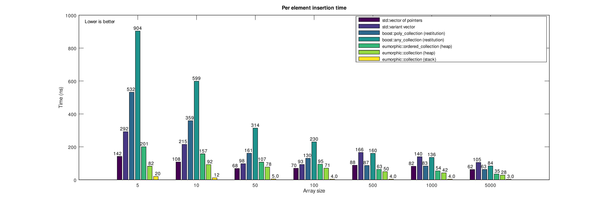
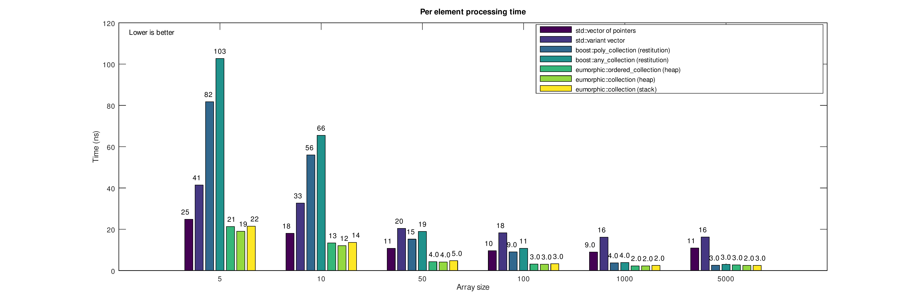

# eumorphic
[Type preserving dynamic heterogeneous containers for C++.]


```eumorphic``` is a *proof of concept* implementation of containers that are type agnostic and do not rely on dynamic dispatch. 

 The design is motivated by the following needs.
 1. Eliminate coupling between the data types stored in heterogeneous containers.
 2. Eliminate reference semantics both in the interface and the container backbone.
 3. Achieve high performance, beyond what polymorphic or type erasure dynamic dispatch can achieve.
 
 The interface that the present concept can provide,is summarized in the following snippet:
 ```c++
 struct a { }; void process ( const a& ) { /*...*/ }
 struct b { }; void process ( const b& ) { /*...*/ }
 struct c { }; void process ( const c& ) { /*...*/ }
 
 template <class T> using segment_container = std::vector<T>;
 using heap_collection = eumorphic::collection< segment_container, a, b, c >;
 
 //...
 heap_collection collection;

 collection.insert( a{} );
 collection.insert( c{} );
 collection.insert( b{} );
 
 eumorphic::for_each( collection, []( auto &&elem ) { process( elem ); } );
 ```
It should be noted that we are not trying to address all the use cases polymorphism is dealing with - only the cases relating to dynamic heterogeneous containers.

The development is heavily motivated by modern software design concerns raised in [[Parent2013]](https://www.youtube.com/watch?v=bIhUE5uUFOA).

# Core concept
As a data structure, ```eumorphic::collection``` is a tuple of arrays of different types. For example:
```cpp
hana::tuple< std::vector<int>, std::vector<string>, std::vector<MyType> > collection_data;
```
The rest of the implementation deals with insertion and access operations for unordered (where the user does not care about the iteration order) and ordered collections (where the user expects that the iteration order will be the same with the insertion order).

# Properties
``eumorphic`` achieves dynamic heterogeneous containers that observe the following:

1. There are no polymorphic types, only a use of similar types.
2. Minimal boilerplate.
3. Minimal adaptation requirements for existing types.
4. Value semantics.
5. No coupling.
6. Performance - No overhead due to elimination of runtime dispatch for unordered collections of data.
7. Able to be used in non-template functions.

The properties list is a modification of the list in [[Bandela2019]](https://github.com/CppCon/CppCon2019/blob/master/Presentations/polymorphism__virtual/polymorphism__virtual__john_bandela__cppcon_2019.pdf).

# Performance
Benchmarks comparing eumorphic with other types, for insertion and basic processing operations follow. Compiled with MSVC 2019 16.2.5.



# Conclusions
We developed concepts that demonstrate that dynamic heterogeneous containers do not generally need to rely on dynamic dispatch. Also, we demonstrate that such ideas could provide total decoupling between types. They also result in interfaces with extremely low boilerplate requirements. An additional advantage is that decoupled heterogeneous dynamic containers can be constructed on the stack.
 
