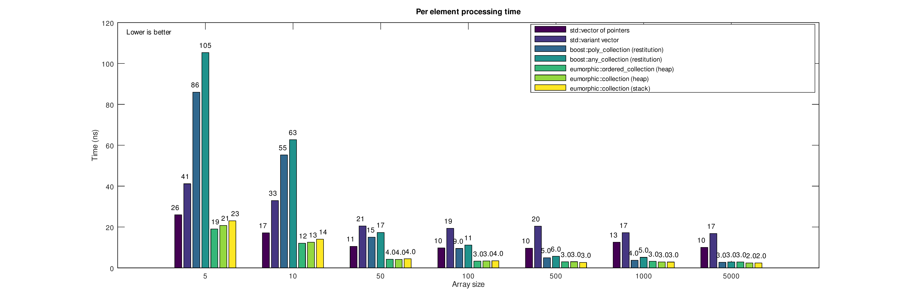

# eumoprhic
Type preserving dynamic heterogeneous containers for C++.

```eumorphic``` is a proof of concept implementation of containers that are type agnostic. 

 The design is motivated by the following needs.
 1. Eliminate coupling between the data types stored in heterogeneous containers.
 2. Eliminate reference semantics both in the interface and the container backbone.
 3. Achieve high performance, beyond what polymorphic or type erasure dynamic dispatch can achieve.
 
 The interface that the present concept can provide,is summarized in the following snippet:
 ```c++
 struct a { }; void process ( const a& ) { /*...*/ }
 struct b { }; void process ( const b& ) { /*...*/ }
 struct c { }; void process ( const c& ) { /*...*/ }
 
 template <class T> using segment_container = std::vector<T>;
 using heap_collection = eumorphic::collection< segment_container, a, b, c >;
 
 collection.insert( a{} );
 collection.insert( c{} );
 collection.insert( b{} );
 
 eumorphic::for_each( collection, []( auto &&elem ) { process( elem ); } );
 ```
It should be noted that we are not trying to address all the use cases polymorphism is dealing with - only the cases relating to dynamic heterogeneous containers.

The development is heavily motivated by modern software design issues raised in [[Parent2013]](https://www.youtube.com/watch?v=bIhUE5uUFOA).

## Performance

**The requirement of a polymorphic type, by definition, comes from its use.** 

``eumorphic`` achieves dynamic heterogeneous containers that observe the following:

1. There are no polymorphic types, only a use of similar types.
2. Minimal boilerplate
3. Easy adaptation of existing classes.
4. Value semantics.
5. No coupling.
6. Performance - We completely avoid overhead of runtime dispatch.
7. Able to be used in non-template functions.

The properties list was adapted from [[Bandela2019]](https://github.com/CppCon/CppCon2019/blob/master/Presentations/polymorphism__virtual/polymorphism__virtual__john_bandela__cppcon_2019.pdf).

# Performance
Benchmarks comparing eumorphic with other types, for insertion and basic processing operations follow.



# Conclusions
We developed concepts that demosntrate that dynamic heterogeneous containers do not generally need to rely on dynamic dispatch. Also, we demonstrated that such ideas could provide total decoupling between types. They also result in interfaces with extremely low boilerplate requirements. An additional advantage is that decoupled heterogeneous dynamic containers can be constructed on the stack.
 
